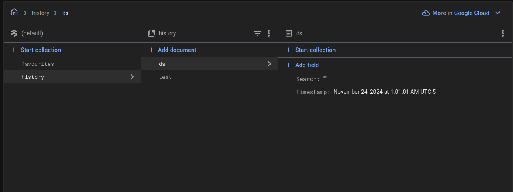

# Installation Guide for ShopSync

Welcome to the installation guide for ShopSync! Follow these steps to set up the project on your local machine.

## Prerequisites

Before you begin, ensure you have the following installed:

- [Git](https://git-scm.com/) for cloning the repository.
- [Python](https://www.python.org/downloads/) (below version 3.12 and above 3.10 ) for running the application.
- [Pip](https://pip.pypa.io/en/stable/installation/) for managing Python packages.

## Steps to Install

1. Clone the Github repository to a desired location on your computer. You will need git preinstalled on your machine. Once the repository is cloned, you will then cd into the local repository.

2. Build the local enviroment: 
   
   Mac/Linux:
   
    ```make env: python3 -m venv venv run env : source venv/bin/activate```
   
    Windows: 
   
    ```make env: python -m venv venv run env : venv\Scripts\activate```

3. This project uses Python 3, so make sure that Python and Pip are preinstalled. All requirements of the project are listed in the requirements.txt file. Use pip to install all of those.
   
    ```pip3 install -r requirements.txt```

4. Navigate to http://firebase.google.com and create an account

5. Click "Get Started with a Firebase project" and create a name, this can be any name you want. Be sure to accept the two checkboxes and then hit "Continue"

6. Enable or Diasble Analytics depending on what you want to do and then hit "Continue"

7. You may see another page about accepting the analytics and then you just need to hit "Create Project"

8. Once on the main "Project Overview" page, scroll down until you see "Authentication" which you should then click on.

9. Click "Get Started" on the authentication page and select the "Email/Password" under "Native providers". Enable the "Email/Password" section and not the passwordless one unless you want to.

10. Now on the left sidebar you should see the "Build" dropdown, click then and select "Firestore Database"

11. Click "Create a Database" and leave the defaults. Click "Next" and then leave it in "production mode" and finally hit "Create"

12. You will now need to create two collections, one for the favorites and one for the history. Here are the two images you will need to reference and create the two databases based upon **You do not need to make the test document**:
    
    

13. Next at the top left you will see "Project Overview", and beside it a gear icon. Click on the "Gear Icon" and then select "Project settings"

14. You will then need to navigate to the "Service accounts" page and the click "Generate new private key" using all defaults. It should start downloading a json file which you will need for later.

15. Now click on "General" and then copy the "Web API Key" which we will need for the next step.

16. Next, head on into the cloned repository where you will need to create a file named ".env" in the src/frontend directory. You will need to input the Web API Key you just copied into it like shown below:
    
    ```bash
    FIREBASE_WEB_API_KEY=<copied key>
    ```

17. Next, you will need to place the json file which you downloaded into the same src/frontend folder

18. Now you just need to replace all mentions of any other json file matching the same patten with the name of your downloaded json file. I recommend using the global search function in VS Code to do this.

19. Once all the requirements are installed, you will have to cd into the src folder. Once in the src folder, use the python command to run the main.py file.
    
     ```cd src```
    
     Mac/Linux: ```python3 main.py```
    
     Windows: ```python main.py```

20. To run the Streamlit application go onto a different terminal and go to frontend folder:
    
    ```bash
    cd src/frontend
    streamlit run app.py
    ```
